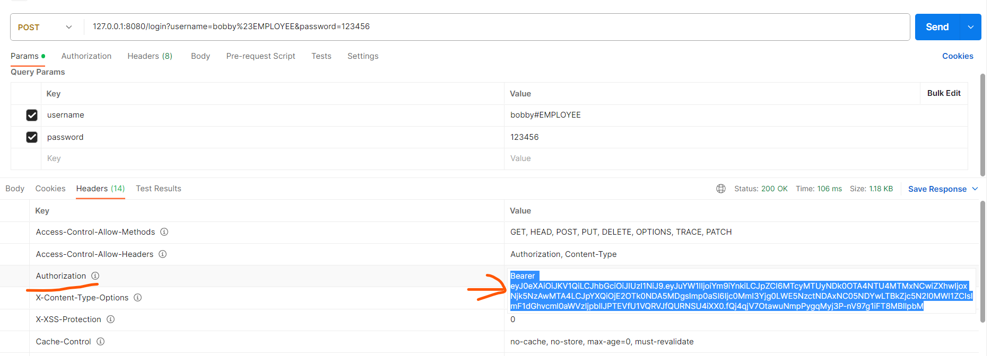
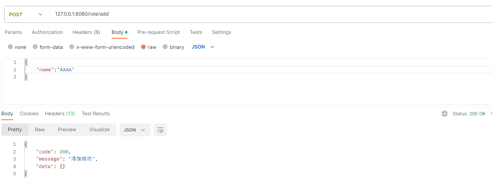

Springboot3 + Mybatis Plus + Security6 + JWT 一个简化的Security+JWT的登录认证

基于[SpringBoot-Vue-Template-Jwt
](https://github.com/itbaima-study/SpringBoot-Vue-Template-Jwt) 的后端进行一些修改 ，丢弃了一些功能，后续学习该项目时再补上

# 项目环境

- JDK17及以上

- Springboot 3

- idea 2021.3

项目运行前先

- 配置项目JDK：File->project structure


JDK17以上即可,

language level 16以上（如果没有16及以上，更新下idea）

- 导入数据库：sql/expressxxx.sql (创建数据库即表都在一个sql文件里)或 sql/expressxxx/ tablexxx.sql (分别创建表的sql文件)

- 启动redis：群文件 Redis-7.0.14-xxx.tar.gz 解压 并运行 redis-server.exe

# 目录结构说明

```java
-com.team24.security  //根目录
    - common 
        - AjaxResult    // 后端返回结果
        - xxx   // 其他全局公共属性
    - config // 配置
        - mp    // mybatis-plus 配置
        - redis // 暂时没有引入redis
        - security  // spring security 6 配置
            - filter    // 请求过滤器
            - userdetails   // 登录验证的UserDetails
            - EmployeePermissionEvaluator.java  // hasPermission 自定义验证
            - SecurityConfiguration.java    // security 配置类
        - swagger   // api 文档
    - controller    // 控制器
    - entity    // 实体类
        - dto   // 封装的一些数据传输对象DTO
    - mapper    // mybatis Mapper接口
    - service   // 业务服务及实现
    - util  // 工具类

- resources
    - mapper    // mybatis xml 数据库映射xml文件
    - application.yml   // 项目相关配置
```

# [Mybatis Plus](https://baomidou.com/)

## QueryWrapper写法

QueryWrapper查询一般在Service层实现

```java

@Service
public class EmployeeServiceImpl implements EmployeeService {
    @Resource
    EmployeeMapper employeeMapper;

    /**
     * QueryWrapper 写法
     */
    @Override
    public Employee selectByUsername(String username) {
        QueryWrapper<Employee> wrapper = new QueryWrapper<>();
        wrapper.eq("username", username);
        return employeeMapper.selectOne(wrapper);   // 找到具体的一个
    }

    /**
     * 利用传统 *Mapper.xml 的写法
     */
    @Override
    public Employee selectByCode(String code) {
        return employeeMapper.selectByCode(code);
    }
}
```

## 传统xml写法

在resources/mapper新建相应的*Mapper.xml文件，示例如下：

```xml
<?xml version="1.0" encoding="UTF-8"?>
<!DOCTYPE mapper PUBLIC "-//mybatis.org//DTD Mapper 3.0//EN" "<http://mybatis.org/dtd/mybatis-3-mapper.dtd>">
<mapper namespace="com.team24.express.mapper.EmployeeMapper">

    <!--    namespace 具体到自定义的Mapper接口，其余部分为固定模板-->
    <!--    在 mapper 代码块内编写 sql 操作-->
    <!--    id 应与 Mapper接口类种定义的方法名一致，且 resultType 为该接口方法的返回类型-->
    <select id="selectByCode" resultType="com.team24.express.entity.Employee">
        select * from employee
        <where>
            <if test="code !=null and code != ''">
                code = #{code}
            </if>
        </where>
    </select>

</mapper>

```

# JUnit

单元测试，可用来快速测试数据库操作是否正确。

新建的单元测试类位于 test/java/com/bobby/securityjwt/*Tests.java

例如EmployeeMapperTests测试类，该测试类种测试了 insert, select 等CRUD操作

```java

@SpringBootTest
public class EmployeeMapperTests {
    @Resource
    EmployeeMapper mapper;
    @Resource
    PasswordEncoder passwordEncoder;

    @Test
    public void insert() {
        Employee employee = new Employee();
        employee.setCode("sf8848");
        employee.setUsername("bobby");
        employee.setPassword(passwordEncoder.encode("123456"));
        employee.setName("黄准备");
        employee.setAccountStatus(0);   // normal
        employee.setCreateTime(LocalDateTime.now());
        org.junit.Assert.assertTrue(mapper.insert(employee) > 0);
    }

    @Test
    public void selectByCode() {
        String code = "sf8848";
        Employee employee = mapper.selectByCode(code);
        org.junit.Assert.assertNotNull(employee);
        System.out.println(employee);
    }
}
```

# Security 角色认证

预定义了 5 中角色，见common/RoleConst.java

```java
public final class RoleConst {
    public final static String SUPER_ADMIN = "ROLE_SUPER_ADMIN";    // 超级管理员
    public final static String STATION_ADMIN = "ROLE_STATION_ADMIN";    // 站点管理员
    public final static String DELIVERY_MAN = "ROLE_DELIVERY_MAN";  // 快递员
    public final static String EMPLOYEE = "ROLE_EMPLOYEE";  // 员工
    public static final String USER = "ROLE_USER";  //用户
}
```

## 使用

```java
    @PreAuthorize("hasAnyRole('SUPER_ADMIN','STATION_ADMIN')")
    @PostMapping("/delete")
    public AjaxResult delete(@RequestParam("id") Long id) {
        if (userService.deleteById(id))
            return AjaxResult.success("删除成功");
        else return AjaxResult.error("删除失败");
    }
```

使用@PreAuthorize("hasAnyRole('SUPER_ADMIN','STATION_ADMIN')")注解。

其中@hasAnyRole() 会在传入的字符串前加前缀 'ROLE_'，而@hasRole() 则不会。

因此若判断是否具有权限ROLE_SUPER_ADMIN，采用@hasAnyRole('SUPER_ADMIN')，而采用@hasRole('ROLE_SUPER_ADMIN')


使用该注解实现了在后端进行权限验证和拦截。

# OpenAPI

[SpringBoot集成Swagger3.0（详细） - 蚂蚁小哥 - 博客园](https://www.cnblogs.com/antLaddie/p/17418078.html#_label1_3:~:text=public%20class%20SwaggerOpenApiConfig%20%7B%0A%7D-,4%EF%BC%9A%E9%85%8D%E7%BD%AEAPI%E6%8E%A5%E5%8F%A3%E4%BF%A1%E6%81%AF%EF%BC%88%E6%B3%A8%E8%A7%A3%EF%BC%8C%E9%87%8D%E8%A6%81,-%EF%BC%89)

默认访问地址：http://localhost:8080/swagger-ui.html

采用API注解的方式，使前端人员方便查看后端API接口，便于开发。

# 统一返回接口：Result

为了便于前后端接口统一，规定后端接口返回类为Result，格式如下：

```json
{
    code: xxx,
    message: xxx,
    data: {
        xxx
    }
}
```

例如，请求所有用户

```json
{
    "code": 200,
    "message": "查询成功",
    "data": [
        {
            "id": "1721524122505601025",
            "username": "vividbobo",
            "password": "$2a$10$uQeh.YYXpgnXjDndwMajA./SgdkMA3GjgSJJ2rOlXVagK4GGKYUrO",
            "avatar": null,
            "email": "abc@163.com",
            "accountStatus": 0,
            "createTime": null, 
            ...
```

# 后端编写流程

以 RoleController 为例

## 1 创建Mapper

/mapper/RoleMapper.java

Mybatis-Plus特性，创建的Mapper类直接继承BaseMapper\<Role\> 即可实现基本的CRUD

```java
@Mapper // 注意有注解
public interface RoleMapper extends BaseMapper<Role> {
    Role getRoleByRoleName(String name);
}
```

## 2 创建Service

/service/RoleService.java

创建Service接口

```java
public interface RoleService {
    boolean insert(Role role);

    boolean edit(Role role);

    boolean delete(Integer id);
}

```

实现Service接口

/service/impl/RoleServiceImpl.java

```java
@Service    // 注意有注解
public class RoleServiceImpl implements RoleService {
    @Resource
    RoleMapper roleMapper;  // 注入依赖 Mapper

    @Override
    public boolean insert(Role role) {
        if (roleMapper.insert(role) > 0) return true;
        return false;
    }

    @Override
    public boolean edit(Role role) {
        if (roleMapper.updateById(role) > 0) return true;
        return false;
    }

    @Override
    public boolean delete(Integer id) {
        if (roleMapper.deleteById(id) > 0) return true;
        return false;
    }
}


```

## 3 创建Controller

/controller/RoleController.java

```java
@Tag(name = "RoleController", description = "角色相关接口")   // ApiDoc相关
@RestController
@RequestMapping("/role")    // 请求地址
public class RoleController {
    @Resource
    RoleService roleService;    // 依赖注入


    /**
     * @param role 角色实体
     * @return
     */
    @Operation(summary = "角色添加", description = "添加前端返回的json对象实体",
            parameters = {
                    @Parameter(name = "role", description = "角色实体", schema = @Schema(implementation = Role.class))
            },
            responses = {
                    @ApiResponse(description = "返回添加结果",
                            content = @Content(schema = @Schema(implementation = Result.class)))
            }
    )
    @PostMapping("/add")
    public Result add(@RequestBody Role role) {
        if (roleService.insert(role)) return Result.success("添加成功");
        return Result.error("添加失败");
    }
```

## 4 创建测试用例

使用JUnit进行用例测试。

再test/com/team24/.../ 创建 RoleTests，进行RoleMapper测试。并查看数据库该操作是否成功

```java
@SpringBootTest
public class RoleTests {
    @Resource
    RoleMapper roleMapper;

    @Test
    void createRoles() {
        String[] roleNames = new String[]{
                RoleConst.USER,
                RoleConst.EMPLOYEE,
                RoleConst.DELIVERY_MAN,
                RoleConst.STATION_ADMIN,
                RoleConst.SUPER_ADMIN
        };
```

## 5 PostMan测试

使用PostMan测试控制器

需要用户先登录

```java
127.0.0.1:8080/login?username=bobby%23EMPLOYEE&password=123456
```

将返回的HEADER的Authorization 复制



新建一个窗口，填写测试url

```java
127.0.0.1:8080/role/add
```




