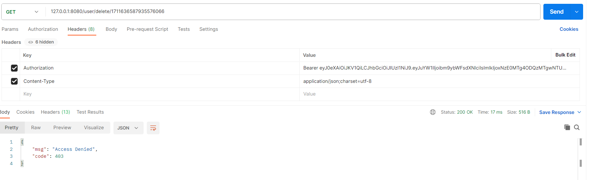

Springboot3 + Mybatis Plus + Security6 + JWT 一个简化的Security+JWT的登录认证

基于[SpringBoot-Vue-Template-Jwt
](https://github.com/itbaima-study/SpringBoot-Vue-Template-Jwt) 的后端进行一些修改 ，丢弃了一些功能，后续学习该项目时再补上

# 项目环境

JDK17及以上

# 目录结构说明

```java
-com.team24.security  //根目录
    - common 
        - AjaxResult    // 后端返回结果
        - xxx   // 其他全局公共属性
    - config // 配置
        - mp    // mybatis-plus 配置
        - redis // 暂时没有引入redis
        - security  // spring security 6 配置
            - filter    // 请求过滤器
            - userdetails   // 登录验证的UserDetails
            - EmployeePermissionEvaluator.java  // hasPermission 自定义验证
            - SecurityConfiguration.java    // security 配置类
        - swagger   // api 文档
    - controller    // 控制器
    - entity    // 实体类
        - dto   // 封装的一些数据传输对象DTO
    - mapper    // mybatis Mapper接口
    - service   // 业务服务及实现
    - util  // 工具类

- resources
    - mapper    // mybatis xml 数据库映射xml文件
    - application.yml   // 项目相关配置
```

# [Mybatis Plus](https://baomidou.com/)

## QueryWrapper写法

QueryWrapper查询一般在Service层实现

```java

@Service
public class EmployeeServiceImpl implements EmployeeService {
    @Resource
    EmployeeMapper employeeMapper;

    /**
     * QueryWrapper 写法
     */
    @Override
    public Employee selectByUsername(String username) {
        QueryWrapper<Employee> wrapper = new QueryWrapper<>();
        wrapper.eq("username", username);
        return employeeMapper.selectOne(wrapper);   // 找到具体的一个
    }

    /**
     * 利用传统 *Mapper.xml 的写法
     */
    @Override
    public Employee selectByCode(String code) {
        return employeeMapper.selectByCode(code);
    }
}
```

## 传统xml写法

在resources/mapper新建相应的*Mapper.xml文件，示例如下：

```xml
<?xml version="1.0" encoding="UTF-8"?>
<!DOCTYPE mapper PUBLIC "-//mybatis.org//DTD Mapper 3.0//EN" "<http://mybatis.org/dtd/mybatis-3-mapper.dtd>">
<mapper namespace="com.team24.express.mapper.EmployeeMapper">

    <!--    namespace 具体到自定义的Mapper接口，其余部分为固定模板-->
    <!--    在 mapper 代码块内编写 sql 操作-->
    <!--    id 应与 Mapper接口类种定义的方法名一致，且 resultType 为该接口方法的返回类型-->
    <select id="selectByCode" resultType="com.team24.express.entity.Employee">
        select * from employee
        <where>
            <if test="code !=null and code != ''">
                code = #{code}
            </if>
        </where>
    </select>

</mapper>

```

# JUnit

单元测试，可用来快速测试数据库操作是否正确。

新建的单元测试类位于 test/java/com/bobby/securityjwt/*Tests.java

例如EmployeeMapperTests测试类，该测试类种测试了 insert, select 等CRUD操作

```java

@SpringBootTest
public class EmployeeMapperTests {
    @Resource
    EmployeeMapper mapper;
    @Resource
    PasswordEncoder passwordEncoder;

    @Test
    public void insert() {
        Employee employee = new Employee();
        employee.setCode("sf8848");
        employee.setUsername("bobby");
        employee.setPassword(passwordEncoder.encode("123456"));
        employee.setName("黄准备");
        employee.setAccountStatus(0);   // normal
        employee.setCreateTime(LocalDateTime.now());
        org.junit.Assert.assertTrue(mapper.insert(employee) > 0);
    }

    @Test
    public void selectByCode() {
        String code = "sf8848";
        Employee employee = mapper.selectByCode(code);
        org.junit.Assert.assertNotNull(employee);
        System.out.println(employee);
    }
}
```

# [Spring Security 6](https://docs.spring.io/spring-security/reference/index.html)

Spring Security 是 Spring 组织提供的一个**开源安全框架**，基于 Spring 开发。目前最新版为，需要JDK 17及以上。

Security 过滤原理

## 双端登录（2 login pages ）

同一套后端，两个表(user, employee)，两个登录页面。

## 认证与权限

在很多情况下，系统将用户分为两个角色：普通用户和管理员。普通用户对某一操作只有查看权限，而管理员则拥有修改权限。

在本项目中，构建了如下应用场景：

### 角色认证

基于角色的访问认证，在方法上定义@PreAuthorize("hasRole('ROLE_USER')")，则该请求要求登录用户有ROLE_USER的角色。

### 权限验证

通过自定义 PermissionEvaluator 进行权限验证。

这里只重写了一个方法

```java
public class EmployeePermissionEvaluator implements PermissionEvaluator {

    @Resource
    PermissionMapper permissionMapper;

    /**
     * eg:  user/list
     * user/edit/{id}
     * user/insert
     * user/delete/{id}
     * 定义这个权限的目的是，使得授权进一步具体化。举个不太恰当的例子，例如，角色为站点管理员拥有 user/list权限，而没有insert, eidt和delete权限
     * 而 超级管理员 拥有上述的所有权限。在具体方法上可添加注解 @PreAuthorize("hasPermission(xxx,xxx)")
     *
     * @param authentication     会自动传过来当前登录的用户
     * @param targetDomainObject 目标域，例如上面url中的 user
     * @param permission         权限：例如上面中的 edit
     * @return
     * @PreAuthorize("hasPermission('user','edit')")
     * @RequestMapping("/user/{id}") public AjaxResult edit(@PathVariable("id") Long id){
     * ...
     * }
     * <p>
     * 然后在下面的方法内验证，authentication 是否拥有域为user的edit权限
     * <p>
     * 因此，稍稍复杂化一些，同时也需要将角色对特定域所拥有的权限也存入数据库
     * <p>
     * Quesiton: 如何读取这些权限呢? 因为 authentication 只拥有UserDetails的信息
     * 1. 根据角色从数据库读取权限? 相应的就要引入 PermissionService
     * 2.
     */

    @Override
    public boolean hasPermission(Authentication authentication, Object targetDomainObject, Object permission) {
        // 根据 roleName 获取相应的 Permissionso
        for (GrantedAuthority grantedAuthority : authentication.getAuthorities()) {
            String roleName = grantedAuthority.getAuthority();
            List<PermissionDto> permissionDtoList = permissionMapper.getPermissionsByRoleName(roleName);
            for (PermissionDto pDto : permissionDtoList) {
                if (pDto.getDomain().equals(targetDomainObject) && pDto.getPermission().equals(permission))
                    return true;
            }
        }

        return false;
    }

    @Override
    public boolean hasPermission(Authentication authentication, Serializable targetId, String targetType, Object permission) {
        return false;
    }
}
```

在方法上使用注解 @PreAuthorize("hasPermission('user','delete')")

@PreAuthorize 指的是在进入该方法前，进行hasPermission的权限校验

#### @hasPermission测试

* ROLE_SUPER_ADMIN角色，对域"user"拥有"read","add","delete","edit" 权限
* ROLE_NORMAL_EMPLOYEE角色，对域"user"只拥有"read"权限


将登录结果的token复制到请求的Header中，由于ROLE_NORMAL_EMPLOYEE没有user:delete的权限，因此访问拒绝




